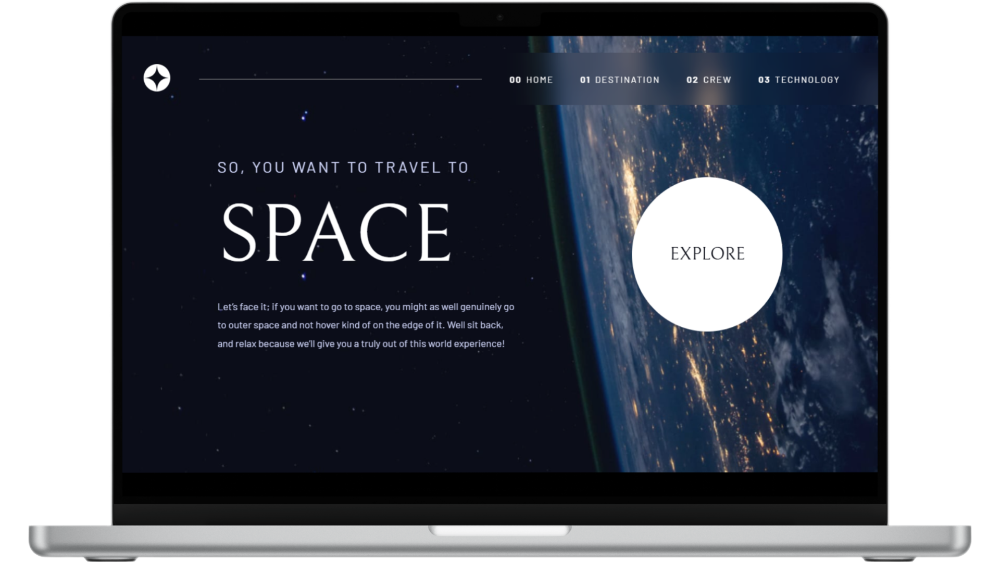

# Tourism Space

<figure>
    
</figure>

## 📝 **Sobre o Projeto**

    Tourism Space é um site interativo desenvolvido em React.js, com o objetivo de oferecer uma experiência educativa e envolvente sobre a exploração espacial. Através de uma interface moderna e responsiva, o site adapta-se perfeitamente a diferentes dispositivos, proporcionando uma navegação fluida em desktops, tablets e smartphones. Ele fornece informações detalhadas sobre planetas, tripulações e lançamentos de naves espaciais, com os dados dinamicamente gerenciados a partir de um arquivo JSON, facilitando a organização e a atualização das informações.

[Demo do Projeto](https://space-tourism-walacedev.netlify.app/) 

## 🛠️ **Tecnologias Utilizadas**

- **React.js** → Biblioteca JavaScript para construção de interfaces.
- **Vite** → Ferramenta de build rápida para desenvolvimento front-end.
- **CSS3** → Para estilização e design responsivo.
- **React Router** → Biblioteca para gerenciamento de rotas em aplicações React.
_ **ESLint** → Ferramenta para padronização e linting do código JavaScript/JSX.

## 🚀 **Recursos Principais**
- **Interface Interativa:** Proporciona uma experiência envolvente e educativa sobre a exploração espacial.

- **Design Responsivo:** Adapta-se perfeitamente a diferentes dispositivos, como desktops, tablets e smartphones.

- **Informações Detalhadas:** Fornece dados sobre planetas, tripulações e lançamentos de naves espaciais.

- **Gerenciamento Dinâmico de Dados:** Utiliza um arquivo JSON para organizar e atualizar informações sobre tripulantes, naves e planetas.

- **Navegação Suave:** Garante uma experiência de usuário fluida e intuitiva.

## 📂 **Estrutura do Projeto**

├── public              # Arquivos públicos (favicons, imagens estáticas, etc.) 
│   ├── assets          # Recursos estáticos (imagens, fontes, etc.) 
│   └── favicon.svg     # Ícone do site 
├── src                 # Código-fonte do projeto 
│   ├── components      # Componentes reutilizáveis 
│   ├── pages           # Páginas do projeto 
│   ├── router          # Configuração de rotas (React Router) 
│   ├── main.jsx        # Arquivo principal da aplicação 
│   └── App.jsx         # Componente raiz 
├── .gitignore          # Arquivos ignorados pelo Git 
├── .gitattributes      # Configurações do Git 
├── index.html          # Estrutura principal da aplicação (carregado pelo Vite) 
├── package.json        # Dependências e scripts do projeto 
├── vite.config.js      # Configurações do Vite 
├── README.md           # Documentação do projeto 
└── LICENSE             # Licença do projeto 

